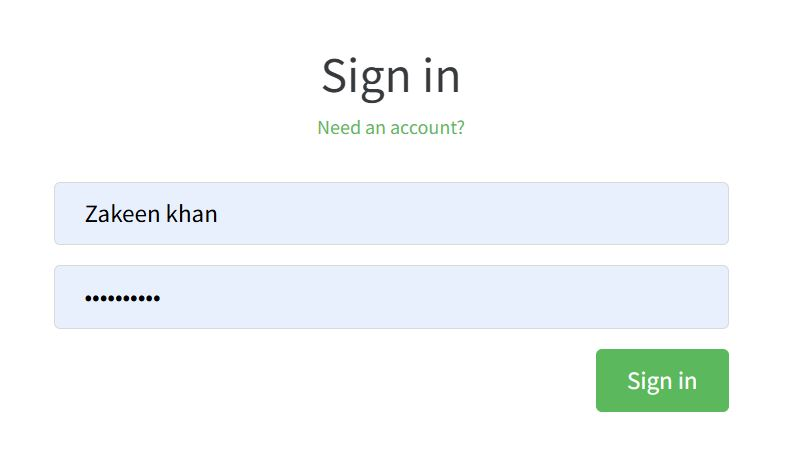
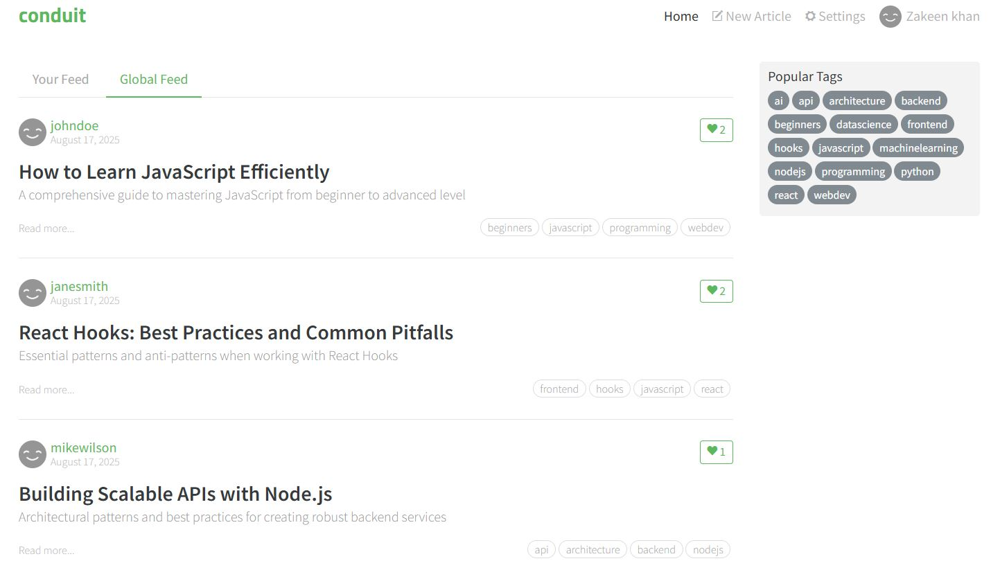
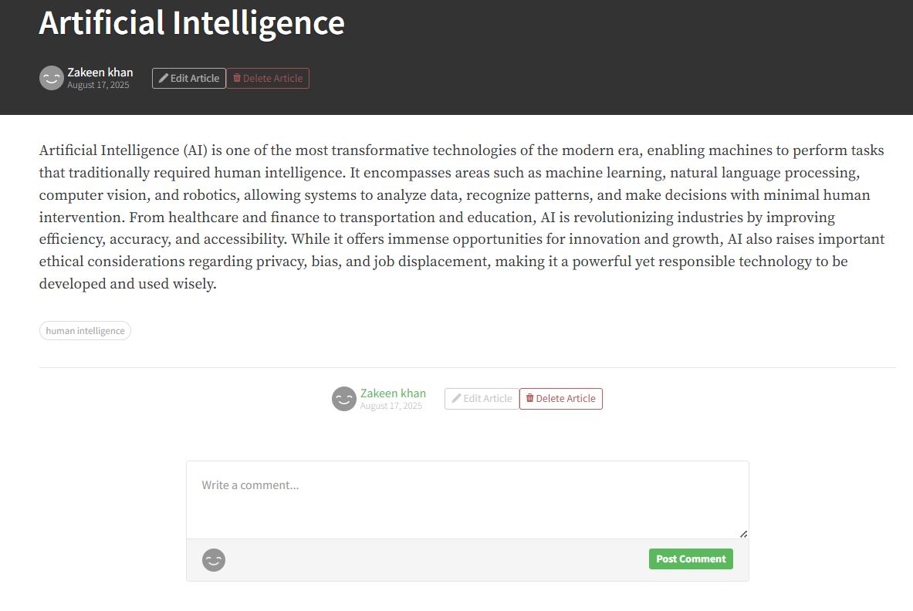
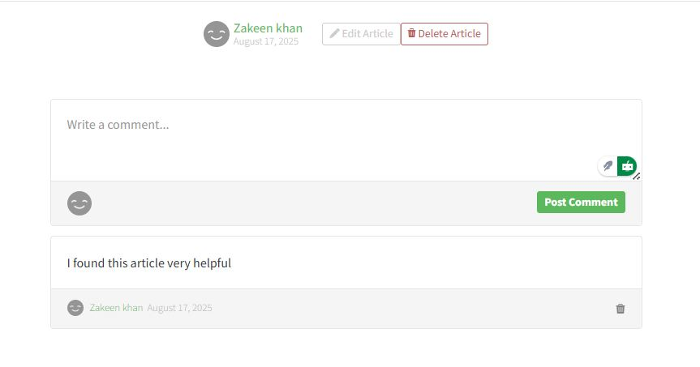
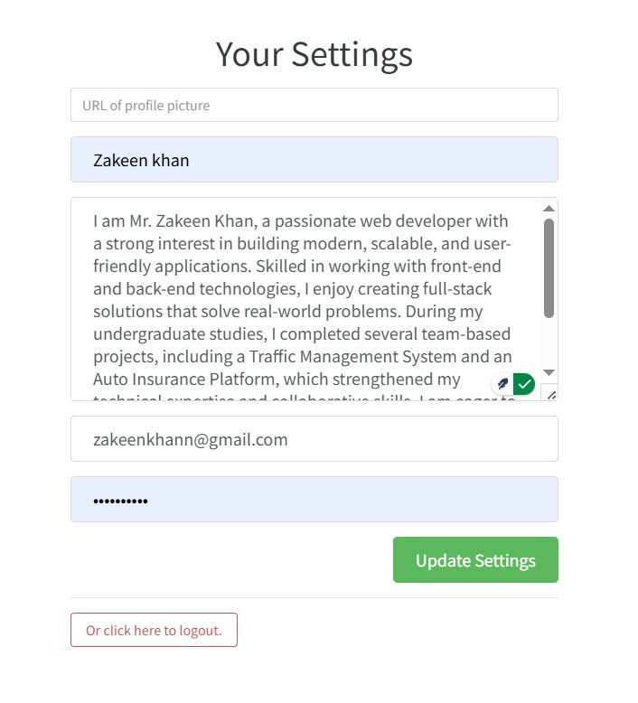
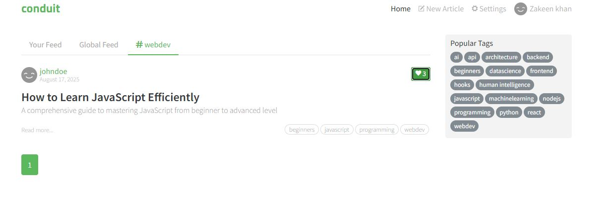

# Conduit Articles Platform

[](https://opensource.org/licenses/MIT)

A modern, full-stack blogging platform built with modern web technologies. Create, share, and discover articles on various topics.

## 🚀 Live Demo

Check out the live demo: [https://demo.realworld.show/#/](https://demo.realworld.show/#/)

## ✨ Features

- 📝 Create and publish articles with rich text formatting
- 🔍 Discover articles by tags and authors
- 💬 Comment on articles and engage with the community
- ❤️ Like and favorite articles
- 👤 User profiles with following/followers functionality
- 🔒 Secure authentication system

## 🛠️ Tech Stack

- **Backend**: Node.js with Nitro
- **Database**: SQLite with Prisma ORM
- **Authentication**: JWT (JSON Web Tokens)
- **API**: RESTful API design
- **Runtime**: Node.js
- **Package Manager**: npm
- **Testing**: Prisma (for database operations)

## 🚀 Quick Start

### Prerequisites

- Node.js (v16 or higher)
- npm or yarn
- Git

### Installation

1. Clone the repository:
   ```bash
   git clone https://github.com/zakeenkhan/Conduit-Articles.git
   cd Conduit-Articles
   ```

2. Install dependencies:
   ```bash
   cd apps/api
   npm install
   ```

3. Set up environment variables:
   ```bash
   cp .env.example .env
   # Update the environment variables as needed
   ```

4. Run database migrations:
   ```bash
   npx prisma migrate dev
   ```

5. Start the development server:
   ```bash
   npm run dev
   ```

The API will be available at `http://localhost:3000`

## 📚 API Documentation

For detailed API documentation, check out the [API Documentation](api/README.md).

## 🤝 Contributing

Contributions are welcome! Please read our [Contributing Guidelines](CONTRIBUTING.md) to get started.

## 📄 License

This project is licensed under the MIT License - see the [LICENSE](LICENSE) file for details.

## 📸 Screenshots

<div style="display: grid; grid-template-columns: repeat(2, 1fr); gap: 20px; margin: 20px 0;">
  <div>
    
    <p align="center">Sign In</p>
  </div>
  <div>
    
    <p align="center">Articles Feed</p>
  </div>
  <div>
    
    <p align="center">Create New Article</p>
  </div>
  <div>
    
    <p align="center">Add Comments</p>
  </div>
  <div>
    
    <p align="center">User Settings</p>
  </div>
  <div>
    
    <p align="center">Popular Tags</p>
  </div>
</div>

## 🙏 Acknowledgments

- Inspired by Medium and Dev.to
- Built with ❤️ and modern web technologies

---


